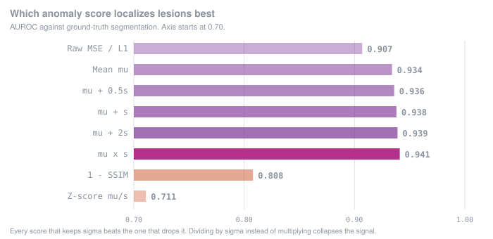
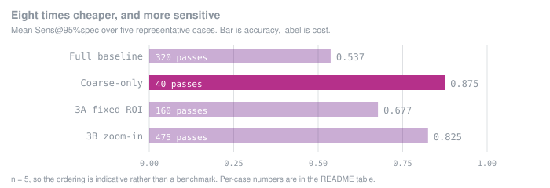
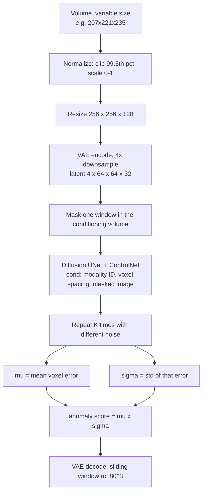

# Generative Anomaly Detection in 3D Medical Imaging

**Unsupervised lesion localization with a latent diffusion model that has only ever seen healthy
tissue — and a result that contradicts how these systems are usually tuned.**

A MAISI latent diffusion model with ControlNet conditioning is trained exclusively on volumes
containing no lesion. At inference it is asked to rebuild a masked region of a new volume from the
surrounding anatomy. Where the rebuilt tissue disagrees with what is actually there, something is
abnormal. No lesion label is ever used for training.

> **Status.** Preliminary research, unpublished. Collaborative work at Duke University's Center
> for Virtual Imaging Trials. Breast MRI results below are measured. The multi-organ extension in
> [Where this goes next](#where-this-goes-next) is a **dataset study and roadmap — selected, not
> yet run**, and is labelled as such throughout. Nothing here is clinically validated or deployed.

---

## Three contributions

| | Contribution | Evidence |
|---|---|---|
| **1** | **A better anomaly score.** Weighting reconstruction error by its own stochastic variance — `μ × σ` — outperformed nine alternatives including raw MSE, every additive `μ + kσ` form, and SSIM. | [AUROC 0.941 vs 0.907](#1-a-better-anomaly-score-μ--σ) |
| **2** | **Reconstruction quality and detection accuracy are separate axes.** Two independent lines of evidence: the score that directly measures reconstruction fidelity is among the worst detectors, and spending 4–12× more compute on finer reconstruction made detection worse. | [1 − SSIM at 0.808](#2-reconstruction-quality-is-not-detection-accuracy); [refinement degrades](#3-how-much-compute-the-search-actually-needs) |
| **3** | **A framework that is not breast-specific.** The method needs only healthy volumes for training and segmented lesions for evaluation. Datasets meeting that requirement have been identified across brain MRI, lung CT, whole-body PET/CT and melanoma. | [Where this goes next](#where-this-goes-next) |

---

## 1. A better anomaly score: `μ × σ`

Every stochastic sample rebuilds the same masked region slightly differently. That spread is
usually averaged away as sampling noise. It is not noise.



| Score | AUROC | AUPRC | Dice₉₅ | Sens₉₅ | Spec₉₅ |
|---|---:|---:|---:|---:|---:|
| Raw MSE | 0.907 ± 0.061 | 0.066 | 0.052 | 0.579 | 0.951 |
| L1 residual | 0.907 ± 0.061 | 0.066 | 0.052 | 0.579 | 0.951 |
| Mean μ | 0.934 ± 0.045 | 0.066 | 0.058 | 0.619 | 0.952 |
| μ + 0.5σ | 0.936 ± 0.045 | 0.070 | 0.059 | 0.634 | 0.952 |
| μ + σ | 0.938 ± 0.044 | 0.073 | 0.060 | 0.642 | 0.952 |
| μ + 2σ | 0.939 ± 0.044 | 0.076 | 0.061 | 0.651 | 0.952 |
| **μ × σ** | **0.941 ± 0.042** | **0.082** | **0.062** | **0.666** | **0.952** |
| 1 − SSIM | 0.808 ± 0.077 | 0.013 | 0.028 | 0.244 | 0.951 |
| Z-score μ/σ | 0.711 ± 0.131 | 0.005 | 0.008 | 0.144 | 0.950 |

Ten candidate voxel scores against ground-truth tumour segmentation, specificity fixed at 95%.

Two things make this more than a leaderboard:

- **Every score that keeps σ beats the score that drops it**, and the multiplicative form beats
  every additive one. A lesion is not a place where the model is confidently wrong. It is a place
  where the model is *inconsistently* wrong — each sample invents a different plausible healthy
  tissue.
- **Dividing by σ instead of multiplying collapses the result to 0.711.** That is the control. If
  σ were noise, normalizing by it should help, not destroy the signal.

---

## 2. Reconstruction quality is not detection accuracy

The standing assumption in reconstruction-based anomaly detection is that a better reconstruction
makes a better detector. Two independent results here say otherwise.

**Evidence A — the fidelity metric is a poor detector.** `1 − SSIM` is the one score in the table
that directly measures how good the reconstruction looks. It lands at **0.808 AUROC, 13 points
behind `μ × σ`**, with Sens₉₅ of 0.244 against 0.666.

**Evidence B — buying better reconstructions made detection worse.** Both coarse-to-fine variants
below spend 4× and 12× the compute of the cheap setting to reconstruct suspicious regions more
finely. Both mostly lost to it. See the next section.

The two lines of evidence are independent: one is a property of the metric, the other a property
of the system. They point the same way.

---

## 3. How much compute the search actually needs

The baseline reconstructs a 4×4×4 grid of masked windows with K = 5 stochastic samples each:
**320 diffusion passes per case**. The plan was a coarse pass to propose candidates, then a fine
pass to sharpen them. The coarse pass alone won.



| Case (AUROC) | Full baseline<br>320 passes | Coarse-only<br>40 passes | 3A fixed ROI<br>160 passes | 3B zoom-in<br>475 passes |
|---|---:|---:|---:|---:|
| case_21 | 0.996 | 0.983 | 0.984 | 0.983 |
| case_10 | 0.941 | 0.919 | 0.912 | 0.885 |
| case_06 | 0.805 | **0.977** | 0.888 | 0.978 |
| case_11 | 0.921 | **0.998** | 0.983 | 0.998 |
| case_16 | 0.963 | **0.989** | 0.967 | 0.972 |
| **mean AUROC** | 0.925 | **0.973** | 0.947 | 0.963 |
| **mean Sens₉₅** | 0.537 | **0.875** | 0.677 | 0.825 |

On three of five cases the 8×-cheaper setting beat the exhaustive one outright. On `case_06` it
moved AUROC from 0.805 to 0.977.

### The four inference strategies

<details open>
<summary><b>Full baseline</b> — 4×4×4 grid, 64 windows, K = 5, <b>320 passes</b></summary>

The volume is split into 64 non-overlapping latent windows. Each is masked out of the
conditioning image in turn, the ControlNet-conditioned LDM rebuilds it, and the process repeats
with K = 5 noise draws. Anomaly map is `μ × σ`.
</details>

<details open>
<summary><b>Coarse-only</b> — 2×2×2 grid, 8 windows, K = 5, <b>40 passes</b> &nbsp;← recommended</summary>

The same procedure with larger windows. Tests whether large anatomical context reduces the false
positives that small-window reconstruction creates. It does, decisively.
</details>

<details>
<summary><b>Variant 3A — fixed-ROI refinement</b>, <b>160 passes</b></summary>

Run coarse-only, then refine. Candidates are proposed from the coarse `μ × σ` map: Gaussian
smoothing σ = 1.0, threshold at the 99th percentile, 26-connectivity components, minimum 10
voxels, ranked by summed score, top 3 kept.

For each candidate: ROI 96×96×48 centred on the component centroid, fine windows 64×64×32, stride
32×32×16 (50% overlap), K = 5 — 8 windows × 5 = 40 passes per ROI. Total 40 + 3×40 = 160.

The fine heatmap **overwrites** the coarse one inside the ROI. Where ROIs overlap, the later one
wins.
</details>

<details>
<summary><b>Variant 3B — zoom-in iterative refinement</b>, <b>475 passes</b></summary>

Same candidates, but the ROI is re-centred and shrunk over three levels instead of fixed once.

| Level | ROI | Window | Stride | Overlap | K | Passes |
|---|---|---|---|---|---:|---:|
| 1 | 128×128×64 | 64×64×32 | 48×48×24 | 25% | 3 | 81 |
| 2 | 96×96×48 | 64×64×32 | 48×48×24 | 25% | 3 | 24 |
| final | 96×96×48 | 64×64×32 | 32×32×16 | 50% | 5 | 40 |

After each level the centre moves to the argmax of the local `μ × σ` response. 145 passes per
candidate × 3 candidates + 40 coarse = 475.

3B recovered ground where 3A degraded badly, but at 12× the cost of coarse-only. The
speed–performance tradeoff does not justify it in its current form.
</details>

### Why the refinement failed

Both variants inherited the same design flaw: they **overwrite** the coarse heatmap inside the
refined region rather than combining evidence. Wherever the fine stage was noisier than the coarse
stage, a clean signal was deleted and replaced with a worse one.

The noise has a physical source. Dense fibroglandular tissue in breast MRI is locally an
unpredictable texture. A small reconstruction window sees only that texture, has no anatomical
context to predict it from, rebuilds it badly, and posts a high error — a false positive. A large
window sees the surrounding breast and gets it right.

**More context beat more compute, and that is a property of the tissue, not of the model.** The
untested next step is a merge rule that combines coarse and fine evidence instead of letting one
overwrite the other.

### Window and blending ablations

| Knob | Tested | Conclusion |
|---|---|---|
| Stochastic samples K | 3 vs 5 | **K = 3 is sufficient**; 5 was over-sampling |
| Window overlap | 0% vs 25% | **25% clearly helps** — it removes window-seam artifacts |
| Blending | constant vs Gaussian | **constant is more stable** than Gaussian weighting |

**Recommended configuration**

```
window_frac = 0.5   overlap = 0.25   blending = constant   K = 3   score = μ × σ
```

---

## Method



| Component | Choice |
|---|---|
| Autoencoder | `AutoencoderKlMaisi` (MONAI), 4× spatial downsampling, 4 latent channels |
| Generator | MAISI 3D diffusion UNet + ControlNet, `conditioning_embedding_in_channels=1` |
| Scheduler | Rectified flow, 1000 train timesteps, continuous, 30 inference steps |
| Conditioning | Modality ID (pre / post / subtraction / T2), voxel spacing ×100, masked volume |
| Decode | Sliding window, ROI 80×80×80, overlap 0.4, Gaussian weighting |

---

## Data

### Used for the results above

| Role | Dataset | Detail |
|---|---|---|
| Training | **ODELIA** breast MRI | Lesion-free cases only (`Lesion == 0`), 4 sequences: pre-contrast, post-contrast, subtraction, T2 |
| Evaluation | **MAMA-MIA** (Duke Breast Cancer MRI) | 30 subjects, RAS orientation, resampled to 0.7×0.7×0.75 mm, with binary tumour segmentation. A second crop including the rib cage is also provided. |

The data requirement is deliberately narrow and that is what makes the method portable: **healthy
volumes to train on, and lesion segmentations to evaluate against.** Nothing about the architecture
is breast-specific.

### Where this goes next

The following datasets were surveyed and selected against that requirement. **They have not been
run yet** — this section is the extension plan, not a results table.

<details open>
<summary><b>Brain MRI</b> — the standard benchmark suite in this literature</summary>

| Dataset | Size | Role | Modalities |
|---|---|---|---|
| IXI | 560 healthy MRIs (358 train / 44 val / 156 test) | Healthy-only training | T1, T2 |
| BraTS21 | 2,040 scans, 1,251 labelled | Evaluation | T1, T2, FLAIR |
| ATLAS v2 | 655 scans | Evaluation | T1 |
| MSLUB | 30 patients | Evaluation | T1, T2, FLAIR |
| WMH | 60 scans | Evaluation | T1, FLAIR |

This is the exact train/eval split used by the four diffusion-based baselines in the comparison
table below, which makes it the cleanest head-to-head available.
</details>

<details open>
<summary><b>Lung CT</b> — screening-scale data, annotation quality varies</summary>

| Dataset | Size | Annotation | Notes |
|---|---|---|---|
| NLST | ~75,000 LDCT exams, 25,000+ patients | None (no coordinates, boxes or masks) | Best used as a **healthy-only training** source from negative screening cases |
| LUNA16 | 888 CT scans | Nodule centre + diameter | Directly downloadable; best for quick pipeline testing |
| DLCS (Duke Lung Cancer Screening) | 2,061 LDCT, 3,187 nodules | 3D bounding boxes + Lung-RADS and cancer outcomes | **Preferred main evaluation set**; requires a data request |
| NLST-3D | 969 CT scans, 1,192 nodules | 3D boxes derived from 2D slice annotations | External benchmark; annotations are derived, not original |
| LUNA25 | 4,069 LDCT, 2,120 patients, 6,000+ nodules | Nodule-level / centre-based | Better suited to malignancy classification than voxel localization |

The honest constraint: most lung data gives boxes or centres, not voxel masks, so the voxel-level
Dice and Sens₉₅ metrics used for breast would have to be replaced with detection-style metrics.
</details>

<details open>
<summary><b>Whole body and other sites</b></summary>

| Dataset / site | Detail |
|---|---|
| FDG-PET-CT-Lesions | 513 healthy + 501 lesion-segmented volumes; the clinical data file marks the healthy cases, which is exactly the split this method needs |
| Longitudinal CT with lesions | 300 volumes with lesion segmentation |
| BrainSinoCT | Under review as an additional CT source |
| **Melanoma** | Target site; dataset not yet selected |
</details>

### Baselines to compare against

Surveyed as part of the same study, with a judgement on which comparisons are load-bearing.

| Family | Method | Year | Core idea | Compare? |
|---|---|---|---|---|
| Reconstruction | AE | 2021 | Autoencoder reconstruction error | Must |
| Reconstruction | VAE | 2021 | Probabilistic latent reconstruction | Must |
| Reconstruction | SVAE | 2022 | Spatial VAE for MRI | Common |
| Reconstruction | DAE | 2022 | Denoising autoencoder | Common |
| GAN | f-AnoGAN | 2019 | GAN-based healthy reconstruction | Common |
| Diffusion | DDPM / AnoDDPM | 2022 | Whole-image diffusion reconstruction | Must |
| Diffusion | pDDPM | 2023 | Patch-based diffusion | Must |
| Diffusion | Guided Reconstruction / cDDPM | 2024 | Coarse latent guidance | Strongly recommended |
| Diffusion | MAEDiff | 2024 | MAE-guided patch diffusion | Must |
| Diffusion | MAD-AD | 2025 | Masked latent diffusion, selective reconstruction | Must |
| Diffusion | THOR | 2024 | Strong on small lesions | Recommended |
| Diffusion | PHANES | 2023 | Anatomy-preserving diffusion | Optional |
| **This work** | Latent diffusion + ControlNet + uncertainty | 2026 | Conditioned latent diffusion with stochastic uncertainty as the anomaly signal | — |

Every diffusion baseline in that list scores anomalies as `|original − reconstructed|` and
discards the sampling variance. That is the gap this work targets.

---

## Scope and limitations

- Results are **preliminary and unpublished**. The cost study covers five representative cases, not
  a held-out benchmark; the ordering between refinement variants could move with more cases.
- **AUPRC is low in absolute terms** in every configuration. Tumours occupy a tiny fraction of
  voxels. This is a localization aid, not a detector anyone should act on.
- The multi-organ section is a **dataset study, not results**. No brain, lung, whole-body or
  melanoma experiment has been run.
- The refinement result is a negative finding about **these two designs**, not about coarse-to-fine
  in general.
- No clinical validation, no prospective evaluation, no deployment.
- Two known open problems: a lesion sitting on a sliding-window boundary can have its other half
  copied into the reconstruction, and large distorted lesions are not handled well.

---

## Running it

<details>
<summary><b>Environment</b></summary>

Linux, NVIDIA GPU with CUDA 12.x, conda.

```bash
conda create -n diffusion python=3.14 -y
conda activate diffusion
pip install torch==2.9.1 torchvision==0.24.1 torchaudio==2.9.1 --index-url https://download.pytorch.org/whl/cu128
pip install monai==1.5.1 nibabel==5.3.3 numpy==2.4.0 matplotlib==3.10.8 scipy==1.17.0 \
    tqdm==4.67.1 imageio==2.37.3 pandas==2.3.3 torchio==1.0.0 torchmetrics==1.8.2
```
</details>

<details>
<summary><b>Inference on MAMA-MIA</b></summary>

Set `MODE="inference_MAMA-MIA"` at the top of `run_train_controlnet_odelia.sh`, then:

```bash
bash run_train_controlnet_odelia.sh
```

| Variable | Meaning | Recommended |
|---|---|---|
| `INFER_STRATEGY` | `sliding_window` or `single_pass` | `sliding_window` |
| `MAMA_MIA_WINDOW_FRAC` | window size as a fraction of the latent | `0.5` (the coarse setting) |
| `MAMA_MIA_MODALITY` | conditioning sequence | `mri_breast_pre` |
| `MAMA_MIA_N_SAMPLES` | subjects to process | `30` |

Also set `CUDA_VISIBLE_DEVICES`, `NUM_GPUS`, `TMPDIR` and your conda env name in both shell
scripts. ODELIA paths are only needed for training and ODELIA-specific inference.
</details>

<details>
<summary><b>Other modes</b></summary>

`run_train_controlnet_odelia.sh` — `train`, `visualize_mask`, `preprocess_lesion`,
`visualize_standalone`, `inference`, `inference_MAMA-MIA`

`run_finetune_diff_unet_odelia.sh` — `encode`, `train`, `visualize`
</details>

<details>
<summary><b>What is and is not in this repo</b></summary>

Included: training and inference code, configs, the ControlNet datalist, preprocessing.

Not included: ODELIA (access-controlled), pretrained MAISI weights (~3 GB), finetuned checkpoints.
Update `DATA_DIR`, `EMB_DIR` and `PREP_DIR` in the shell scripts for your own paths.
</details>

---

## Team and contribution

Collaborative research at Duke University's Center for Virtual Imaging Trials.

My work was the inference and evaluation side: rebuilding the inference pipeline, designing and
running the ten-way scoring comparison that produced `μ × σ`, implementing coarse-only and both
coarse-to-fine variants, running the cost study and the K / overlap / blending ablations, and
diagnosing the sliding-window boundary artifacts that motivated soft spatial conditioning.
Training-side work — VAE and diffusion UNet finetuning on ODELIA, ControlNet conditioning, and
MAMA-MIA preprocessing — was shared across the team, as was the dataset and baseline survey.

Built on [MONAI](https://github.com/Project-MONAI/MONAI) and the MAISI generative models.
